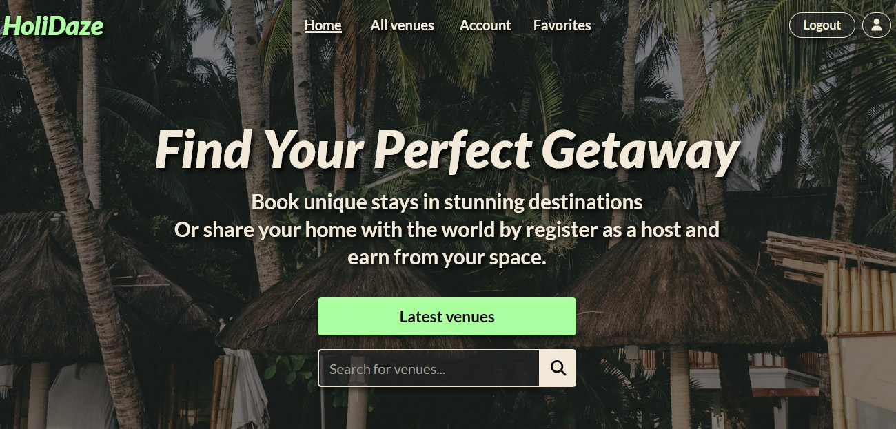

# HoliDaze



Holidaze - My Project Exam 2 at Noroff - is a venue booking platform built with React and Vite.

## Table of Contents

- [Description](#description)
- [Built With](#built-with)
- [Getting Started](#getting-started)
- [Contributing](#contributing)
- [Contact](#contact)

## Description

Holidaze is a comprehensive platform where users can book holiday accommodations and also host their own venues. It features property listings, search functionality, and responsive design. The project is built with React, Vite and Tailwind CSS and integrates with the Noroff API for managing data.

### List of features

1. **Venue Browsing**:

- A user may search for a specific venue
- A user may filter on all venues
- A user may view a specific venue page by its ID

2. **Calendar Integration**:

- A user may view a calendar with available dates for a venue

3. **User Registration**:

- A user with a stud.noroff.no email may register as a customer
- A user with a stud.noroff.no email may register as a venue manager
  Note: Venue managers hosting venues cannot undo their role unless they delete their venues. Venues with bookings cannot be deleted

4. **Customer Features**:

- A registered customer may create a booking at a venue
- A registered customer may view their upcoming bookings

5. **Venue Manager Features**:

- A registered venue manager may create a venue 
- A registered venue manager may update a venue they manage
- A registered venue manager may delete a venue they manage
- A registered venue manager may view bookings for a venue they manage

6. **User Account Management**:

- A registered user may log in
- A registered user may update their avatar, banner and bio
- A registered user may log out

## Built With

- [React](https://react.dev/) – JavaScript library for building user interfaces
- [Vite](https://vitejs.dev/) – Fast frontend build tool and development server
- [Tailwind CSS](https://tailwindcss.com/) – CSS framework
- [React Router](https://reactrouter.com/) – Routing for React
- [React Hook Form](https://react-hook-form.com/) – Forms and validation for React
- [Yup](https://www.npmjs.com/package/yup) – JavaScript schema validation
- [Font Awesome](https://fontawesome.com/) – Icon library
- [date-fns](https://date-fns.org/) – Modern JavaScript date utility library
- [Jest](https://jestjs.io/) – JavaScript testing framework
- [Testing Library](https://testing-library.com/docs/react-testing-library/intro/) – Simple and complete testing utilities for React

## Getting Started

### Installing

Follow these steps to get the project running locally:

1. Clone the repo:

   ```bash
   git clone https://github.com/EliseAur/holidaze.git
   cd holidaze
   ```

2. Install the dependencies:

   ```bash
   npm install
   ```

### Running

To start the development server, run:

```bash
npm run dev
```

This will start the app on [http://localhost:5173](http://localhost:5173) (or the port shown in your terminal).

---

**To preview the production build locally:**

```bash
npm run build
npm run preview
```
---

### Live Demo

- **Link:** https://elise-holidaze.netlify.app

**Note:**  
To test all features, register with a `stud.noroff.no` email address.


## Contributing

Contributions are welcome! If you would like to contribute, please fork the repository and create a pull request with your changes. All contributions will be reviewed before being merged.

## Contact

Feel free to contact me if you have any questions or feedback about the project:

[My Linkedin](https://www.linkedin.com/in/elise-aurtande/)


